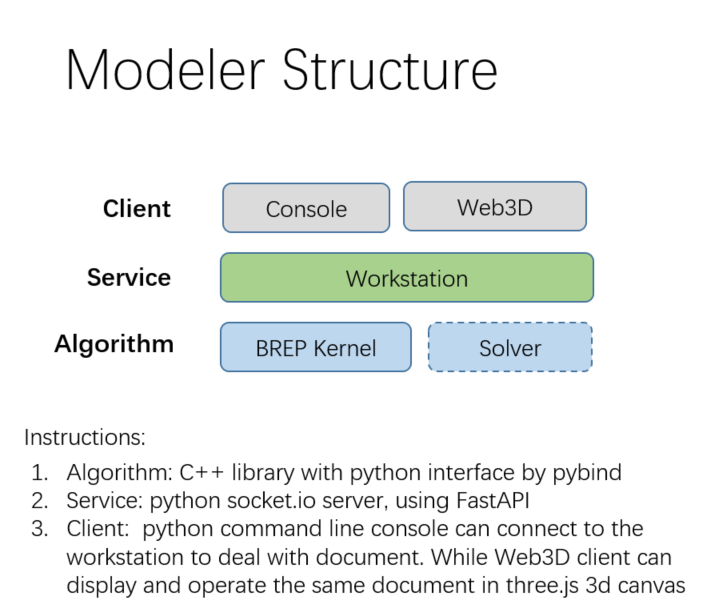

# brep-modeler-server
Brep Modeler workstation and python command line connector

## 总体架构

模块说明:
- BRep kernel
  
    C++的BREP建模库, 使用pybind将其编译为python 的module供本项目调用, 该项目为私有仓库, 有意者请联系本人
- Service
  
    为本项目代码, 将brep的数据存储在server当中, 通过socketio进行数据分发和提供命令api进行操作

- Client

    分为命令行客户端和web3D UI浏览器客户端, 命令行客户端在本项目client目录中, 浏览器客户端在 https://github.com/changyunhai/brep-modeler-web3d, 为React + threejs + socketio

    不同的客户端可以对同一个文档做相同的操作, 文档的数据保存在server当中, 这样可以实现modeler的协同工作和显示.

## 使用说明

- OS:
  
  在windows下使用python 311, 在linux/ubuntu 下使用python 312 来加载modeler的C++扩展

- 运行和调试

    参考workstation/run.py中的说明

## 操作演示

<video controls >
<source src="docs/Video_2024-07-03_162650.mp4" type="video/mp4">
</video>