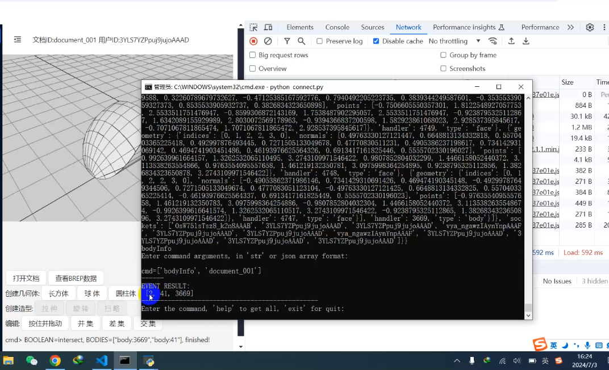

# brep-modeler-server
Brep Modeler workstation and python command line connector

[English](README.md) | [中文](README.zh-CN.md)

NOTE: This repository will not be maintained due of the connection problem to github. The latest source code and deployment are here:

- Source: https://gitee.com/changyunhai001/brep-modeler-server
- Deployment(in Tencent Cloud): http://122.51.170.168/modeler-client/index.html

## software architect

module instruction:
- BRep kernel

    This module is a brep library in C++, which is built by PYBIND11 in Windowns and Ubuntu, called by current project. The kernel is a private project repository.
- Service
  
    Current project is the source code of this module, which manages the brep data in the python server, and distributes data and provides api for the client by SOCKETIO

- Client

    Now we have two types of client: 

    - command line python client. Source code is in client/ 

    - Typescript + React + threejs + socketio project with web3d UI . Source code is in [this repository]( https://github.com/changyunhai/brep-modeler-web3d )
    
    Note that the same document can be operated by different client, all the data stores in python server. In this case, we could get the collaboration design function.

## Usage instruction

- OS:
  
  Now the modeler kernel is built with python 311 in windows, and Python 312 in linux/ubuntu.

- Run and debug:

    reference the file : workstation/run.py

## Demos

